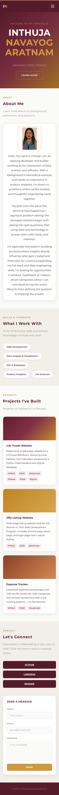
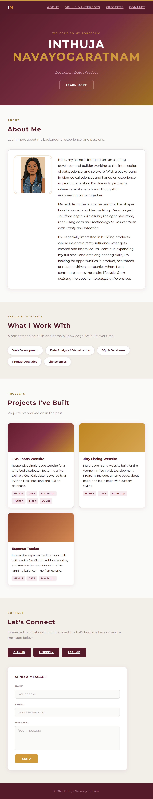
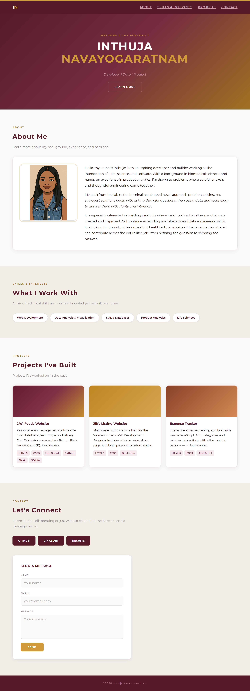

# Inthuja's Portfolio — Portfolio v1

A personal portfolio website built from scratch across a full web development
course — starting as static HTML/CSS, growing into a dynamic vanilla
JavaScript app with live GitHub data, and now shipped as a real npm + Vite
project. This is the "v1" checkpoint before Phase 3 rebuilds parts of it in
React.

## Live Site 
[View Portfolio Here](https://inthuja-nava.github.io/hello-web/)

## Screenshot

| Mobile (375px) | Tablet (768px) | Desktop (1024px) |
| :---: | :---: | :---: |
| <div style="max-height: 400px; overflow-y: auto;"></div> | <div style="max-height: 400px; overflow-y: auto;"></div> | <div style="max-height: 400px; overflow-y: auto;"></div> |

*(Screenshots are from the earlier static version — see the "Future Upgrades" note below about refreshing these for v1.)*

## Features 
- About, with a real bio and background
- Skills & Interests
- **Projects** — 8 real projects (course milestones + independent builds), rendered dynamically from a data array with live category filtering and search
- **GitHub Repositories** — live data fetched directly from the GitHub REST API, with loading and error/retry states
- Contact links (GitHub, LinkedIn), resume link, and a contact form
- Fully responsive across mobile, tablet, and desktop
- Mobile hamburger nav

## Built With
- HTML5 / CSS3 (custom properties, Flexbox, Grid, media queries)
- Vanilla JavaScript (ES Modules, `fetch`, `async`/`await`, DOM manipulation)
- [Vite](https://vite.dev) — dev server + production build
- GitHub REST API for live repository data

## Module Structure

The JavaScript is split into three `src/` modules connected with explicit
`export`/`import` statements. `src/projects.js` owns the Projects section:
the project data, the card template, `renderProjects()`, and the
filter/search logic. `src/api.js` owns the GitHub Repositories section:
`fetchRepos()` talks to the GitHub API, `repoCard()` builds one repo's HTML,
and `renderRepos()` paints the grid. `src/main.js` is the single entry point
loaded by `index.html` — it imports from both modules and handles page
wiring only (the mobile nav toggle, filter/search event listeners, and the
`initRepos()` loading/error flow); it contains no template strings or fetch
calls of its own.

## Running Locally

```bash
npm install
npm run dev
```

## Building for Production

```bash
npm run build      # outputs a static site to dist/
npm run preview    # serves dist/ locally to sanity-check the build
```

## Links
- [GitHub](https://github.com/inthuja-nava)
- [LinkedIn](https://www.linkedin.com/in/inthuja-n-6b658a20a/)

---

## Week 2 Reflection - Style It Up

Styled the page with Montserrat (clean and versatile across weights), a burgundy and champagne gold palette, and a warm cream background. I chose burgundy because it reads as professional without being generic navy, and gold as the accent because it's warm enough to complement it without clashing. All hover effects use a consistent `0.2s ease` transition to keep interactions feeling cohesive.

## Week 3 Reflection - Layout Upgrade

Refactored the nav and hero with Flexbox, and added a CSS Grid project gallery. I used Flexbox for single-row/column components (nav, skills tags, button rows) because it handles one-dimensional spacing cleanly. Grid was the right choice for the project cards because `repeat(auto-fit, minmax(280px, 1fr))` makes the layout fully responsive with no media queries needed.


## Week 4 Reflection - Go Responsive

Refactored the stylesheet to mobile-first: base styles now target 375px, with min-width breakpoints at 768px and 1024px layering on top. Used clamp() for fluid hero and heading sizes so type scales smoothly without jumps, and added a hamburger nav that collapses on mobile and expands on tablet. The main challenge was preventing "Navayogaratnam" from overflowing on small screens. I fixed it by tightening letter-spacing and reducing the clamp() minimum on mobile.

## Weeks 6–8 + Portfolio v1 — Dynamic, Live, and Shipped

Rebuilt the Projects section to render from a JavaScript data array instead
of hardcoded HTML, with live category filtering and search (Week 6). Added
a GitHub Repositories section that fetches real, live data straight from the
GitHub REST API, with proper loading and error/retry states (Week 7).
Migrated the whole site into a real npm + Vite project, splitting the
JavaScript into three focused ES Modules and shipping a production build
instead of raw source files (Week 8). For this v1 checkpoint, I merged in my
independent projects (J.W. Foods Website, Jiffy Listing Website, Expense
Tracker) alongside the course milestones so the Projects section reflects
my full body of work, not just weekly exercises — and consolidated
everything into this one repo as the single source of truth going forward.

---

## Future Upgrades

- ~~**Project screenshot previews** - replace gradient placeholders with real screenshots~~ *(still gradient-based by design — keeps the grid fast and consistent without needing a screenshot for every project)*
- **Active nav highlight** - highlight the current section's nav link as you scroll
- **Working contact form** - connect to Formspree or EmailJS so messages actually send
- **More CSS Patterns** - incorporating more commonly used CSS patterns
- **Phase 3** - rebuild key sections in React for the Capstone Project (Portfolio v2) 